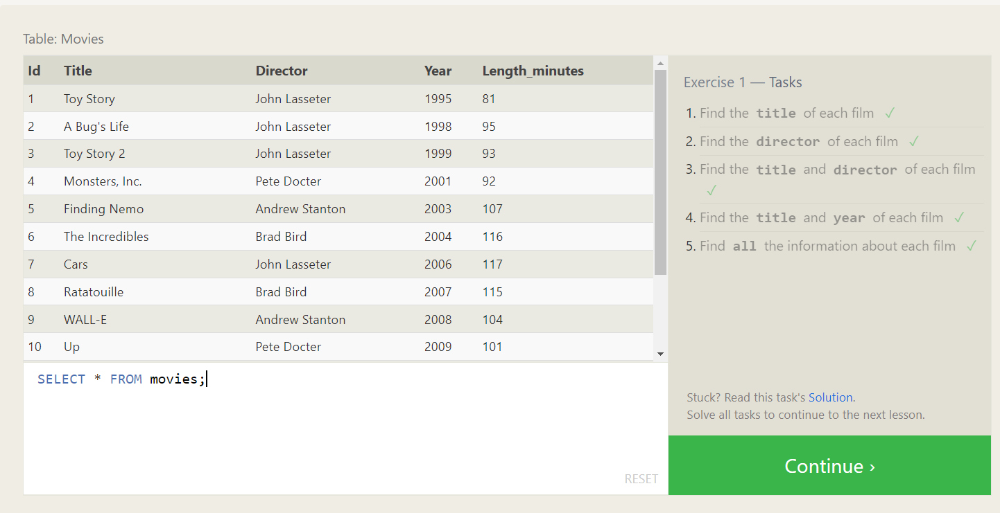
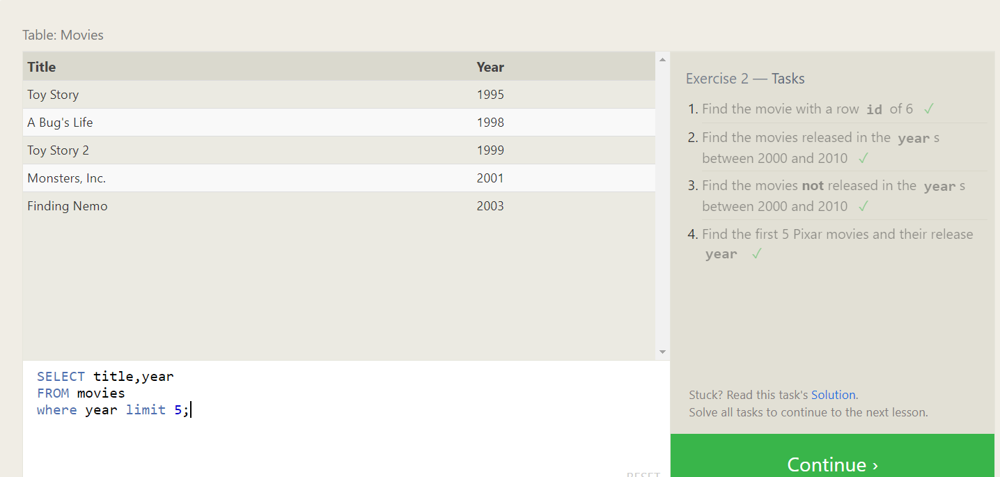
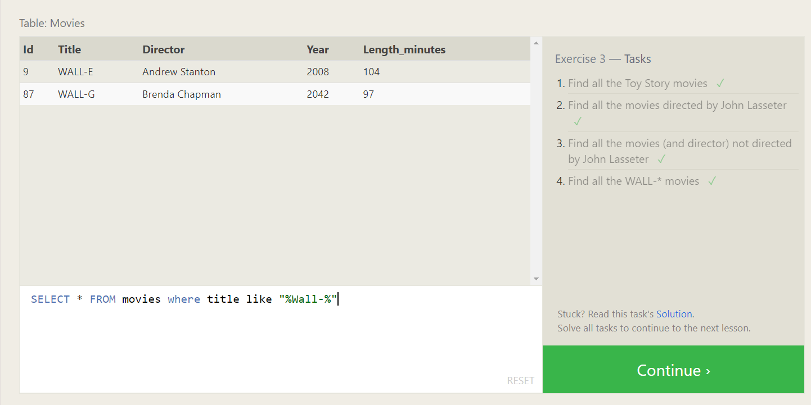
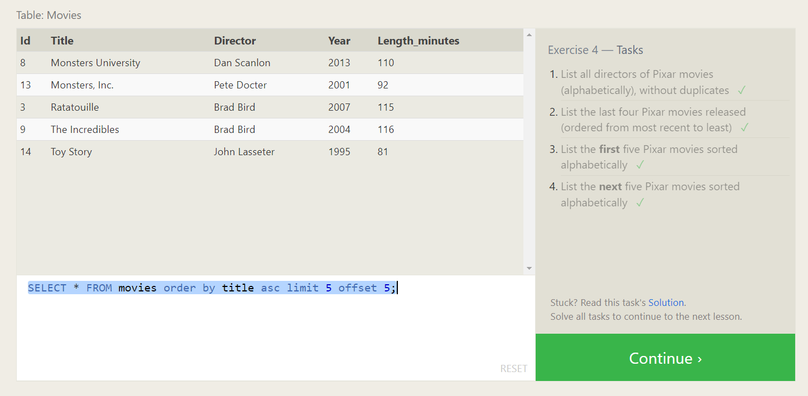

# What is database

# DB featues

- frequently accessed in ram
- Querying is easy
- CRUD
- Backups are inbuilt
- undo - easily
- performance

Exercies:

# Ex-1

Find the title of each film ✓

```sql
select title from movies
```

Find the director of each film ✓

```sql
select director from movies
```

Find the title and director of each film ✓

```sql
select title,director from movies
```

Find the title and year of each film ✓

```sql
select title,year from movies
```

Find all the information about each film

```sql
select * from movies
```



# Ex-2

Find the movie with a row id of 6 ✓

```sql
select title
from movies
where id =6;
```

Find the movies released in the years between 2000 and 2010 ✓

```sql
select title
from movies
where year between 2000 and 2010;
```

Find the movies not released in the years between 2000 and 2010 ✓

```sql
select title
from movies
where year not between 2000 and 2010;
```

Find the first 5 Pixar movies and their release year ✓

```sql
SELECT title,year
FROM movies
where year limit 5;
```



# Ex 3

Find all the Toy Story movies ✓

```sql
SELECT * FROM movies where title like "%Toy%";
```

Find all the movies directed by John Lasseter

```sql
SELECT * FROM movies where director = "John Lasseter";
```

Find all the movies (and director) not directed by John Lasseter

```sql
SELECT * FROM movies where not director = "John Lasseter";
```

Find all the WALL-\* movies

```sql
SELECT * FROM movies where title like "%Wall-%"
```



# Ex-4

List all directors of Pixar movies (alphabetically), without duplicates ✓

```sql
SELECT DISTINCT director FROM movies order by director;
```

List the last four Pixar movies released (ordered from most recent to least) ✓

```sql
SELECT * FROM movies order by year desc limit 4;
```

List the first five Pixar movies sorted alphabetically

```sql
SELECT * FROM movies order by title asc limit 5;
```

List the next five Pixar movies sorted alphabetically

```sql
SELECT * FROM movies order by title asc limit 5 offset 5;
```



# Ex-5

List all the Canadian cities and their populations ✓

```sql
SELECT city,population FROM north_american_cities where country like "canada";
```

Order all the cities in the United States by their latitude from north to south ✓

```sql
SELECT city FROM north_american_cities where country like "united%" order by latitude desc;
```

4. List the two largest cities in Mexico (by population) ✓

```sql
SELECT city FROM north_american_cities where country like "mexi%" order by population desc limit 2;
```

5.List the third and fourth largest cities (by population) in the United States and their population ✓

```sql
SELECT city FROM north_american_cities
WHERE country LIKE "United States"
ORDER BY population DESC
LIMIT 2 OFFSET 2;
```


