# What is database

# DB featues

- frequently accessed copy in the ram
- Querying is easy
- CRUD
- Backups are inbuilt
- undo - easily
- performance

Exercies:

# Ex-1

Find the title of each film ✓

```sql
select title from movies
```

Find the director of each film ✓

```sql
select director from movies
```

Find the title and director of each film ✓

```sql
select title,director from movies
```

Find the title and year of each film ✓

```sql
select title,year from movies
```

Find all the information about each film

```sql
select * from movies
```


# Ex-2

Find the movie with a row id of 6 ✓

```sql
select title
from movies
where id =6;
```

Find the movies released in the years between 2000 and 2010 ✓

```sql
select title
from movies
where year between 2000 and 2010;
```

Find the movies not released in the years between 2000 and 2010 ✓

```sql
select title
from movies
where year not between 2000 and 2010;
```

Find the first 5 Pixar movies and their release year ✓

```sql
SELECT title,year
FROM movies
where year limit 5;
```


# Ex 3

Find all the Toy Story movies ✓

```sql
SELECT * FROM movies where title like "%Toy%";
```

Find all the movies directed by John Lasseter

```sql
SELECT * FROM movies where director = "John Lasseter";
```

Find all the movies (and director) not directed by John Lasseter

```sql
SELECT * FROM movies where not director = "John Lasseter";
```

Find all the WALL-\* movies

```sql
SELECT * FROM movies where title like "%Wall-%"
```


# Ex-4

List all directors of Pixar movies (alphabetically), without duplicates ✓

```sql
SELECT DISTINCT director FROM movies order by director;
```

List the last four Pixar movies released (ordered from most recent to least) ✓

```sql
SELECT * FROM movies order by year desc limit 4;
```

List the first five Pixar movies sorted alphabetically

```sql
SELECT * FROM movies order by title asc limit 5;
```

List the next five Pixar movies sorted alphabetically

```sql
SELECT * FROM movies order by title asc limit 5 offset 5;
```


# Ex-5

List all the Canadian cities and their populations ✓

```sql
SELECT city,population FROM north_american_cities where country like "canada";
```

Order all the cities in the United States by their latitude from north to south ✓

```sql
SELECT city FROM north_american_cities where country like "united%" order by latitude desc;
```

4. List the two largest cities in Mexico (by population) ✓

```sql
SELECT city FROM north_american_cities where country like "mexi%" order by population desc limit 2;
```

5.List the third and fourth largest cities (by population) in the United States and their population ✓

```sql
SELECT city FROM north_american_cities
WHERE country LIKE "United States"
ORDER BY population DESC
LIMIT 2 OFFSET 2;
```


# <span style="color: #FF0000">11-06-2024 | Day-2 | SQL</span>

# Database Issue:

- DRY issue

# Normalization


# Ex-6

Find the domestic and international sales for each movie ✓

```sql
SELECT title, domestic_sales, international_sales
FROM movies
  JOIN boxoffice
    ON movies.id = boxoffice.movie_id;
```

Show the sales numbers for each movie that did better internationally rather than domestically ✓

```sql
SELECT title, domestic_sales, international_sales
FROM movies
  JOIN boxoffice
    ON movies.id = boxoffice.movie_id
WHERE international_sales > domestic_sales;
```

List all the movies by their ratings in descending order ✓

```sql
SELECT title
FROM movies
  JOIN boxoffice
    ON movies.id = boxoffice.movie_id
order by rating desc;
```

# Ex-7

Find the list of all buildings that have employees ✓

```sql
SELECT distinct Building FROM employees;
```

Find the list of all buildings and their capacity ✓

```sql
SELECT  Building_name , Capacity FROM Buildings;
```

List all buildings and the distinct employee roles in each building (including empty buildings) ✓

```sql
SELECT DISTINCT building_name, role
FROM buildings
  LEFT JOIN employees
    ON building_name = building;
```

# Ex-8

Find the name and role of all employees who have not been assigned to a building

```sql
SELECT name,role FROM employees
where building is null;
```

Find the names of the buildings that hold no employees ✓

```sql
SELECT building_name FROM Buildings
left join employees
on building=Building_name
where building is null;
```

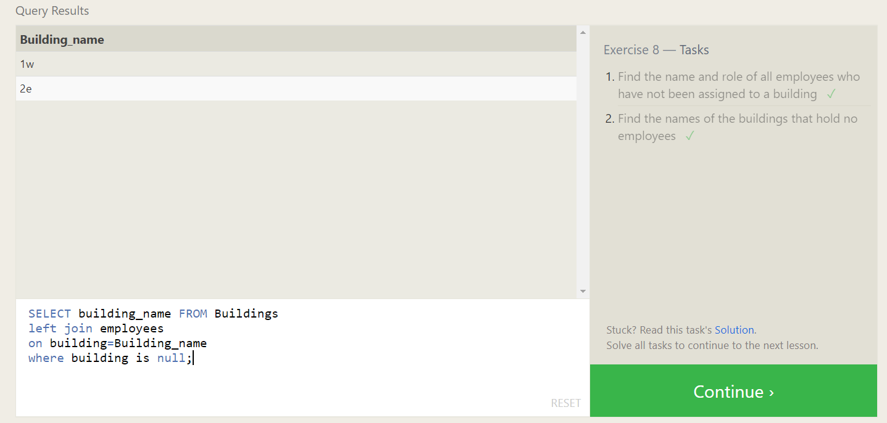

# Ex-9

List all movies and their combined sales in millions of dollars ✓

```sql
SELECT title,
    (domestic_sales + international_sales) / 1000000 AS sales
FROM
    movies
INNER JOIN
    boxoffice
ON
    movies.id = boxoffice.movie_id;
```

List all movies and their ratings in percent ✓

```sql
SELECT title, rating * 10 AS percent
FROM movies
  JOIN boxoffice
    ON movies.id = boxoffice.movie_id;
```

List all movies that were released on even number years ✓

```sql
select title,year
from movies
where year % 2 =0;
```

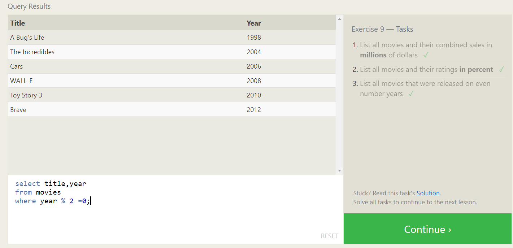

# Ex-10

Find the longest time that an employee has been at the studio ✓

```sql
SELECT MAX(years_employed) as Max_years_employed
FROM employees;
```

For each role, find the average number of years employed by employees in that role ✓

```sql
SELECT role, AVG(Years_employed) as years
FROM employees
group by role;
```

Find the total number of employee years worked in each building ✓

```sql
SELECT building, SUM(years_employed) as Total_years_employed
FROM employees
GROUP BY building;
```

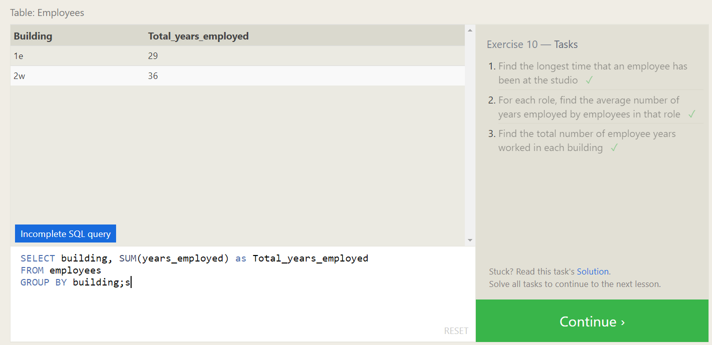

# <span style="color: #FF0000">12-06-2024 | Day- 3| SQL</span>

# Ex-11

Find the number of Artists in the studio (without a HAVING clause) ✓

```sql
SELECT * ,count(Role) FROM employees
where role = "Artist";
```

Find the number of Employees of each role in the studio ✓

```sql
select * ,count(role) from employees
group by role;
```

Find the total number of years employed by all Engineers ✓

```sql
select * , sum(Years_employed) from employees
where role like "engi%";
```

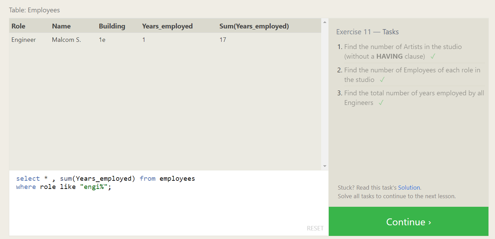

# Ex-12

Find the number of movies each director has directed ✓

```sql
SELECT director , count(Director) FROM movies
group by director;
```

Find the total domestic and international sales that can be attributed to each director ✓

```sql
SELECT director, SUM(domestic_sales + international_sales) as total
FROM movies
    INNER JOIN boxoffice
        ON movies.id = boxoffice.movie_id
GROUP BY director;
```

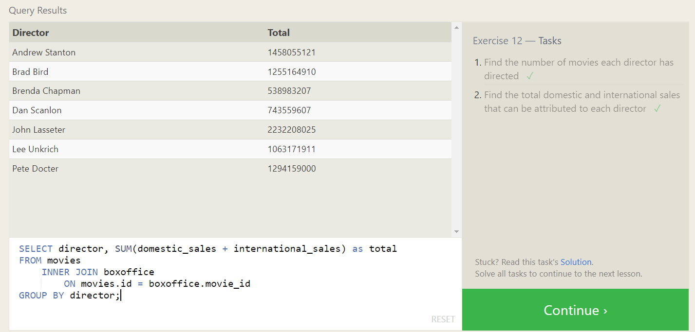

# Ex-13

Add the studio's new production, Toy Story 4 to the list of movies (you can use any director) ✓

```sql
insert into Movies values(15,"Toy Story 4", "Nikhil",2003,22);
```

Toy Story 4 has been released to critical acclaim! It had a rating of 8.7, and made 340 million domestically and 270 million internationally. Add the record to the BoxOffice table. ✓

```sql
insert into BoxOffice values(15,8.7,340000000,270000000);
```

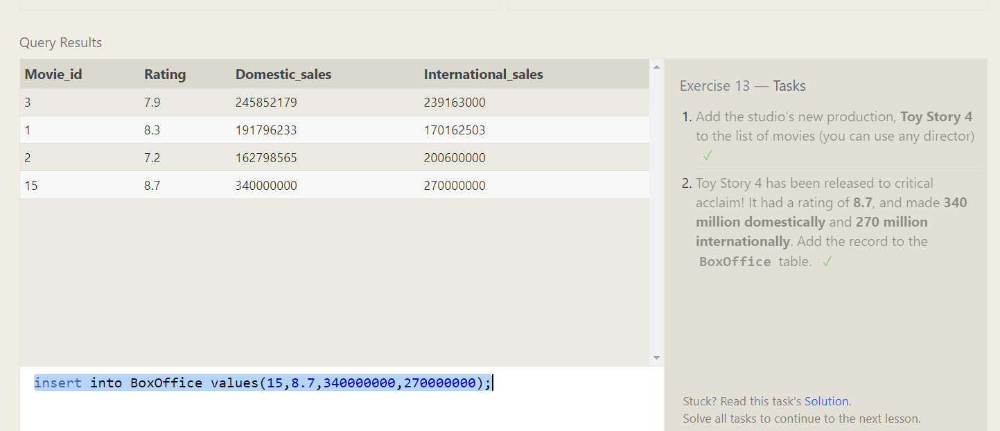

# Ex-14

The director for A Bug's Life is incorrect, it was actually directed by John Lasseter ✓

```sql
UPDATE Movies
SET Director = "John Lasseter"
WHERE title like 'A Bug%';
```

The year that Toy Story 2 was released is incorrect, it was actually released in 1999 ✓

```sql
UPDATE Movies
SET year = 1999
WHERE title like 'Toy Story 2%';
```

Both the title and director for Toy Story 8 is incorrect! The title should be "Toy Story 3" and it was directed by Lee Unkrich ✓

```sql
UPDATE Movies
SET title = "Toy Story 3" , director = "Lee Unkrich"
WHERE title like 'Toy Story 8%';
```

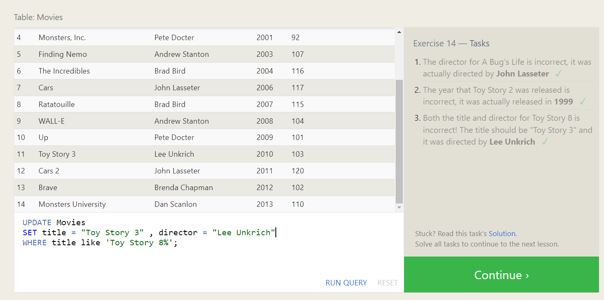

# Ex-15

This database is getting too big, lets remove all movies that were released before 2005. ✓

```sql
DELETE FROM movies
where year < 2005;
```

Andrew Stanton has also left the studio, so please remove all movies directed by him.

```sql
DELETE FROM movies
where director = "Andrew Stanton";
```

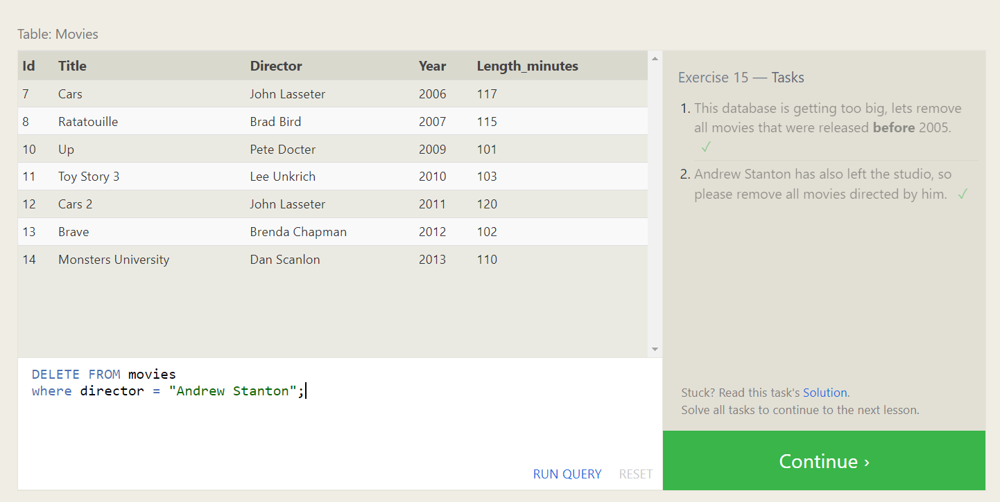

# Ex-16

Create a new table named Database with the following columns:
– Name A string (text) describing the name of the database
– Version A number (floating point) of the latest version of this database
– Download_count An integer count of the number of times this database was downloaded
This table has no constraints.

```sql
create table Database (name varchar,version float,Download_count integer);
```

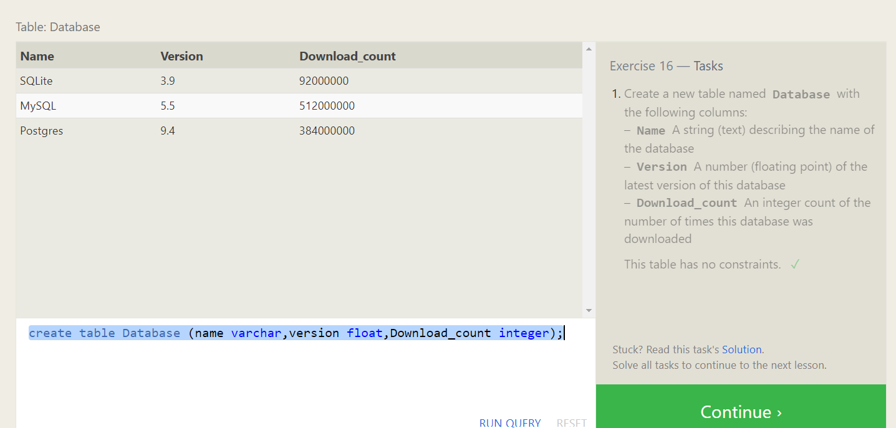

# Ex-17

Add a column named Aspect_ratio with a FLOAT data type to store the aspect-ratio each movie was released in. ✓

```sql
ALTER TABLE Movies
ADD column Aspect_ratio Float
    DEFAULT 1.3;
```

Add another column named Language with a TEXT data type to store the language that the movie was released in. Ensure that the default for this language is English. ✓

```sql
ALTER TABLE Movies
ADD column Language varchar
    DEFAULT ENglish;
```

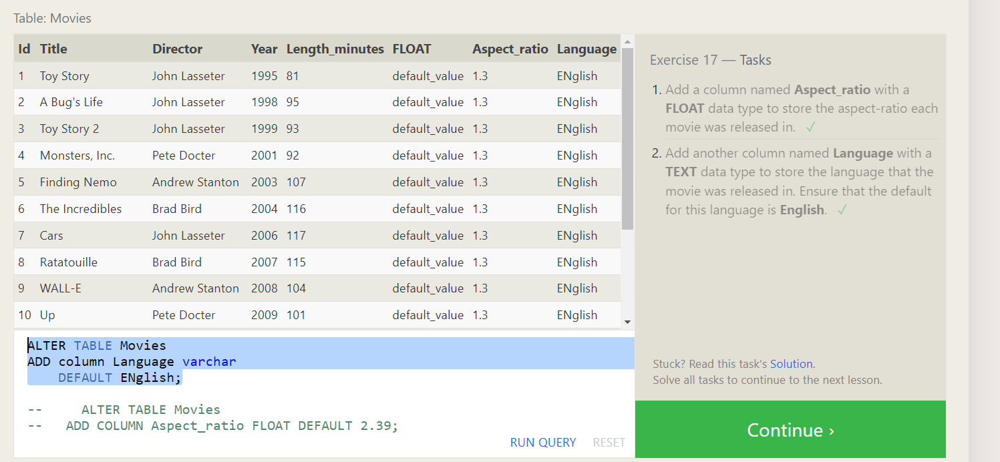

# Ex-18

We've sadly reached the end of our lessons, lets clean up by removing the Movies table ✓

```sql
drop table movies;
```

And drop the BoxOffice table as well

```sql
drop table BoxOffice;
```

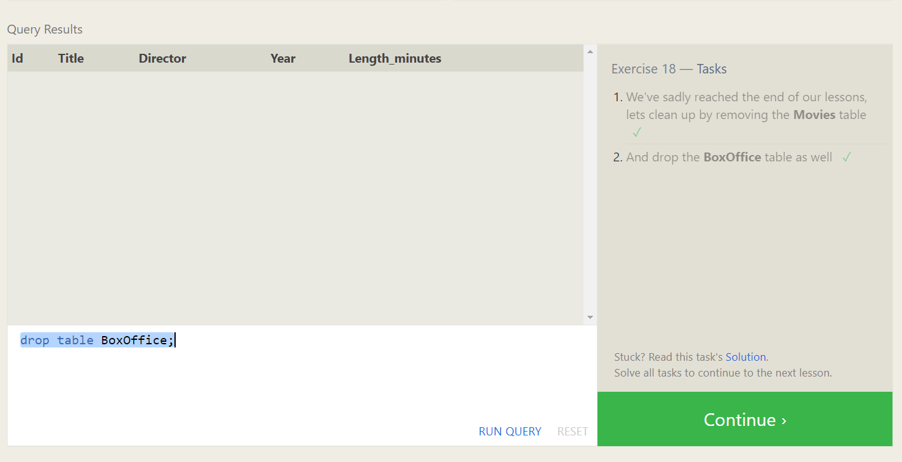

### Completed


# <span style="color: #FF0000">13-06-2024 | Day-4 | SQL</span>

# Data Types

- Integer
- Float, Double, Real
- Character, varchar, text
- Date, Date_time, time
- Blob

## Contraints

- Primary Key
- Foreign Key
- Not Null

  - 

- Interger

  - Int - (-2b)
  - small int (-32k)
  - big int (-9\*10 power 8)

- Characters

  - Varchar

  - nvarchar

    [`supports unicode values for other language & Emoji's`]

- Decimal

  - float (approx) [H performance]
  - decimal (exact) [L performance]

- Date
  - Date
  - Time
  - DateTime

# String functions in DB

- Len
- Left
- Right
- Substring
- Upper
- Lower

select len('nikhil') as NameLen;

select left('hello',3) as left_num;
-- prints left characters of 3 from left

select right('hello',3) as left_num; -- Right

select upper('nikhil') as cap_name; -- upper

select lower('NIKHIL') as cap_name_lower; -- lower

select SUBSTRING('nikhil raj',1,6) as sub; -- substring

- Ltrim
- Rtrim
- charIndex
- Replace
- concat
- Replicate
- Reverse

select ltrim(' nikhil') as trimmer; -- left trim

select rtrim(' nikhil ') as trimmer; -- right trim

select CHARINDEX ('cool','this is really cool') as char_index; -- char index

select CONCAT('nikhil','raj') as con_name; -- cancat

select REPLICATE ('fun',1000000000) as rep; --create duplicate chars

select REPLACE ('ganta is a very good boi','ganta','nikhil') as replace_name -- replace

select REVERSE ('nikhil') as rev_name; -- reverse

# Mathematical

- Abs
- Power
- Round
- Ceiling
- Floor

select abs(-5) as num -- absolute

select power(2,4) as num_power; -- power

select ROUND(99.51599, 3) as discount_price; -- round

select CEILING (58.9) as top_price; -- ceiling gives top

select floor (58.9) as top_price; -- floor gives bottom

# Date

- GetDate
- DateAdd
- DateDIff
- Format
- DatePart

select GETDATE() as today_date; -- gets date

select DATEADD (day,3,GETDATE()) as b; --gives the day by adding to the getdate

select DATEDIFF(YEAR, '2003-05-17', GETDATE()) as can_age; -- calculate differecne between dates

select datepart (DAY,getdate()) as a; -- prints month from date

# <span style="color: #FF0000">14-06-2024 | Day-5 | SQL</span>

# Sub-Queries

# Sets

- Union
